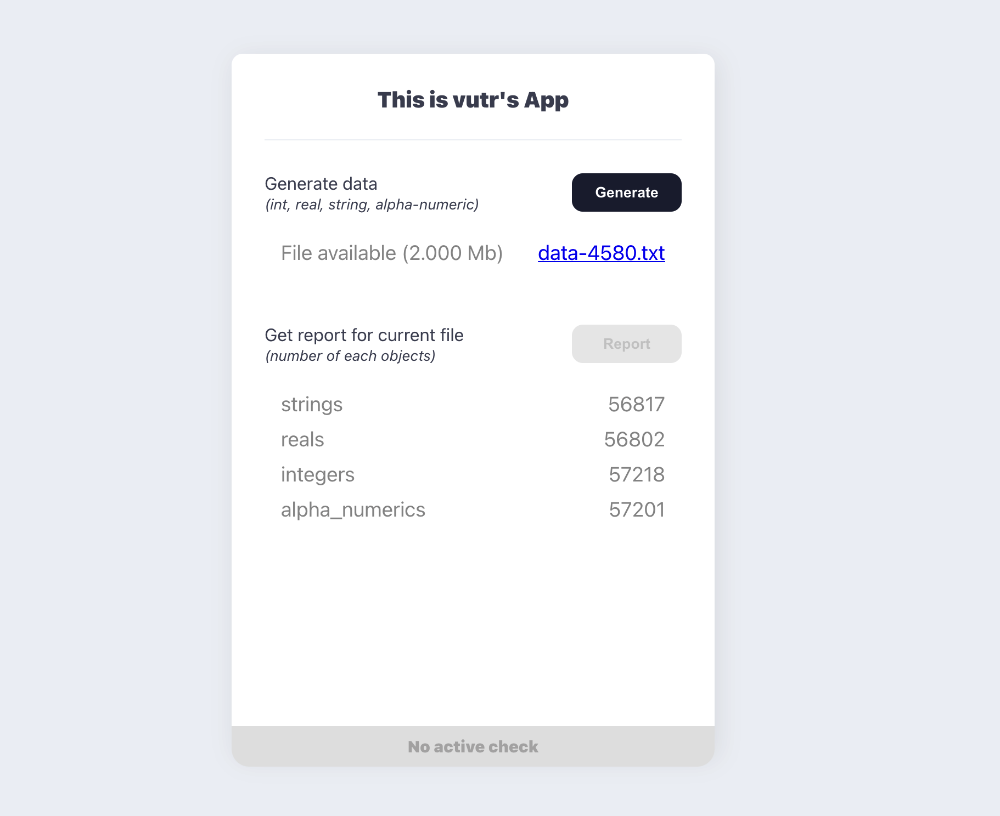

# Demo flaskapp

## Screenshot

<p align="center">
  
</p>

## Running

The most simple way is to run with docker, which has everything bundled and ready to use

```shell
$ docker build -t <image-tag> .
$ docker run -p 3000:3000 --name <container-name> <image-tag>:latest
```

After the application has started, open your web-browser and go to http://localhost:3000

## Development
### Backend
- *Pipenv*, *Python3.8* are required

- Install dependencies and run it
```shell
$ cd backend
$ pipenv install --dev --pre
$ pipenv run dev
```

- Run test with
```shell
$ pipenv run test
```
### Frontend
- Node 14 is required
- Prepare a `.env` file

```
# Not neccessary when running with flask-backend in development mode
REACT_APP_SERVER_URL=http://localhost:3000
# Enable the following env-var when running with flask-backend in development mode
# REACT_APP_API_URL=http://localhost:5000
```

- Run or build with npm
```shell
$ npm start
$ npm run build
```
